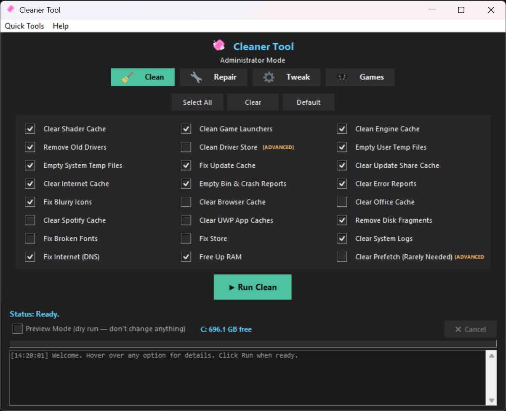

# Cleaner Tool

A simple 1-click Windows cleaner, repair, and tweak app for gamers. Pick what
you want, hit Run, done — no need to babysit it.

Run as Admin (UAC) so everything just works the first time.


<p align="center">
  
</p>

## What it does

**Clean**
- Shader Caches (NVIDIA/AMD/Intel) 
- Game Launcher Caches
- Temp Files 
- Old Driver Leftovers 
- Recycle Bin
- Crash Dumps 
- Browser Cache 
- Thumbnail Cache 
- DNS Cache

**Repair**
- System File Checker  
- DISM Image Repair
- Network Reset
- Windows Update Fixes 
- Broken Start Menu & Search Fixes
- 1-click restore

**Tweak**
- Ultimate Performance Power Plan 
- Game Mode 
- Disable Xbox Background Recording 
- 1:1 Mouse Aim 
- Hardware Accelerated GPU Scheduling 
- Exclude Game Folders From Antivirus Scanning
- Stop Windows Update From Restarting  Mid-game

**Games** 
- one-click cache cleanup for Steam, Epic, EA, GOG, Battle.net, Riot, Ubisoft, Discord, and the Xbox app.

All tweaks can be undone from the same screen. There's also a Preview Mode
that shows you exactly what would happen without changing anything.

## Requirements

Windows 10 or 11. No install needed — just run the .exe.

## Running from source

```powershell
pip install -r requirements.txt   # build tools only, the app itself is stdlib-only
python main.py
```

## Building the .exe yourself

```powershell
pyinstaller --onefile --windowed --name "CleanerTool" --icon "app/assets/icon.ico" --add-data "app/assets;app/assets" --manifest "app/assets/admin_manifest.xml" app/__main__.py
```
