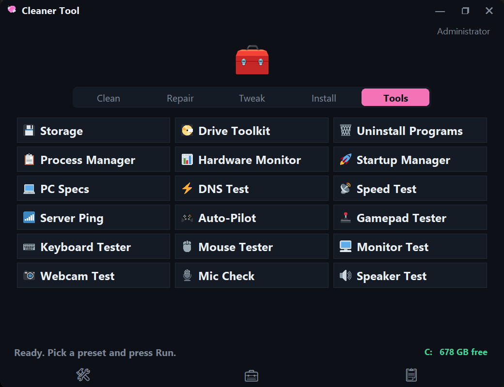

# Cleaner Tool

A free Windows 10/11 utility for gamers: cleans junk, fixes common Windows problems, and applies safe performance tweaks. Pick a preset, press Run, done.

## Safety guarantees

- Cleaning never touches game saves, documents, or user profiles.
- Every tweak ships with a one-click Undo (snapshot + restore). One documented exception: "No Explorer Auto Discovery".
- The app starts unelevated and only requests admin when a selected task actually needs it.
- Junctions / reparse points are refused — the cleaner will not follow them.

## 📸 Screenshots

<table>
  <tr>
    <td align="center" width="50%">
      <b>Clean Tab</b><br/><br/>
      
    </td>
    <td align="center" width="50%">
      <b>Repair Tab</b><br/><br/>
      
    </td>
  </tr>
  <tr>
    <td align="center" width="50%">
      <b>Tweak Tab</b><br/><br/>
      
    </td>
    <td align="center" width="50%">
      <b>Install Tab</b><br/><br/>
      
    </td>
  </tr>
  <tr>
    <td align="center" colspan="2" width="100%">
      <b>Tools Tab</b><br/><br/>
      
    </td>
  </tr>
</table>

---

## What it does

**Clean**
- Quick Clean, Deep Clean, or Custom presets
- Game launchers and chat apps: Steam, Epic, EA, GOG, Battle.net, Riot, Ubisoft, Xbox, Rockstar, Discord, and more
- Game files: logs, crash dumps, and shader caches for 25+ verified top titles (Fortnite, PUBG, BG3, Cyberpunk…) plus an automatic Unity log sweep for indie games — saves are never touched
- Windows junk: temp files, update leftovers, Recycle Bin, thumbnails, browser caches, DNS flush
- Optional debloat: removes preinstalled junk like TikTok and Clipchamp

**Repair**
- Quick Repair or Deep Repair presets
- Fixes system files (SFC + DISM), stuck Windows Updates, network stack, Xbox/Game Pass apps
- SSD health check and retrim, search index, printer spooler, clock sync
- Read-only disk check

**Tweak (reversible, one-click Undo — one exception noted below)**
- Minimal or Recommended presets
- Ultimate Performance power plan, CPU boost, Game Mode, HAGS, Game DVR off
- Classic right-click menu, no mouse acceleration, calmer animations and taskbar
- Lower-ping network tweaks, USB dropout fix
- One-click privacy: no ads/tips, local-only search, telemetry off, system-wide ad blocker

<sub>Exception: the "No Explorer Auto Discovery" tweak (Advanced) can't be
fully undone — Undo resets the setting it changed, but the per-folder view
customizations it clears (Bags/BagMRU) rebuild as you browse, they're not
restored. Every other tweak's Undo is a full, verified revert.</sub>

**Install**
- One-click runtimes every game needs: DirectX, VC++, .NET, Java
- Essentials for stripped Windows (LTSC): Store, winget, Xbox stack, Game Bar, codecs
- Curated app catalog and one-click "Update Everything"

**Tools**
- Storage Insight, PC Health report, fastest-DNS test, and game session Auto-Pilot
- Internet Speed Test with folk-friendly ratings (browsing, gaming, streaming, calls)
- Gamepad Tester (buttons, sticks, triggers) and Mic Check (devices, permission, live level)
- Quick Tools shortcuts: system utilities and settings pages
- Auto Maintenance (🛠️) and Export Logs (📋) live as corner icons on the main window

**Also included**
- Safety checkpoint (restore point) before changes
- Works without admin for cleanups; asks for elevation only when needed
- Auto Maintenance scheduler (daily/weekly/monthly)
- Dark mode UI, log export via the 📋 corner icon

---

## Requirements

- Windows 10 or 11
- Python 3.10+ (source only — the `.exe` needs nothing)

## Run it

```powershell
python main.py
```

Build the `.exe`:

```powershell
pip install -r requirements.txt
pyinstaller --onefile --windowed --name "CleanerTool" --icon "app/assets/icon.ico" --add-data "app/assets;assets" --manifest "app/assets/app_manifest.xml" app/__main__.py
```

Test it:

```powershell
python tools/smoke_gui.py
```