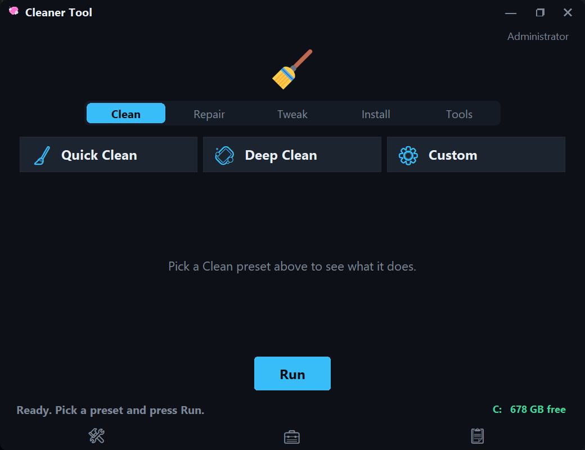
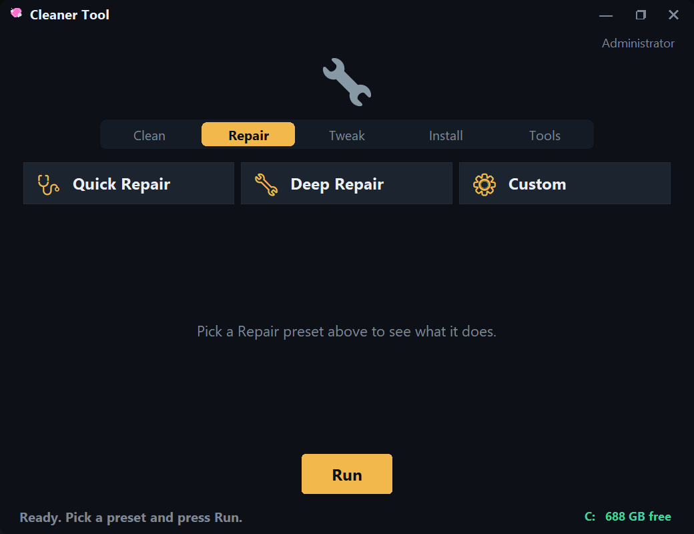
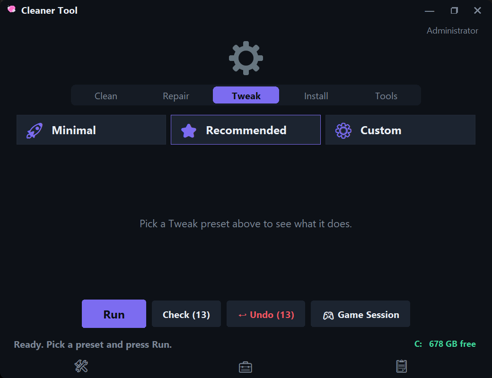
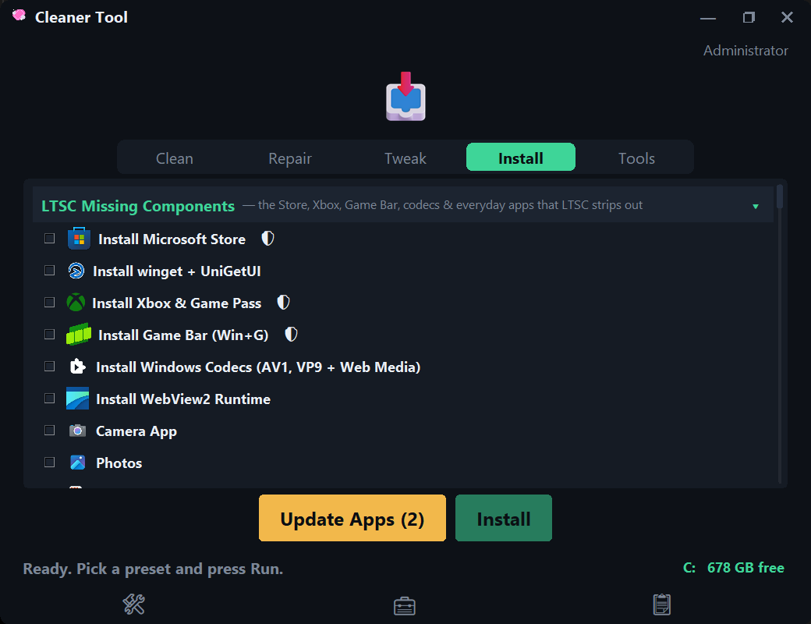

# Cleaner Tool

A free Windows 10/11 utility for gamers: cleans junk, fixes common Windows problems, and applies safe performance tweaks. Pick a preset, press Run, done.

## 📸 Screenshots

<table>
  <tr>
    <td align="center" width="50%">
      <b>Clean Tab</b><br/><br/>
      
    </td>
    <td align="center" width="50%">
      <b>Repair Tab</b><br/><br/>
      
    </td>
  </tr>
  <tr>
    <td align="center" width="50%">
      <b>Tweak Tab</b><br/><br/>
      
    </td>
    <td align="center" width="50%">
      <b>Install Tab</b><br/><br/>
      
    </td>
  </tr>
</table>

---

## What it does

**Clean**
- Quick Clean, Deep Clean, or Custom presets
- Game launchers and chat apps: Steam, Epic, EA, GOG, Battle.net, Riot, Ubisoft, Xbox, Rockstar, Discord, and more
- Game files: logs, crash dumps, and shader caches for 25+ verified top titles (Fortnite, PUBG, BG3, Cyberpunk…) plus an automatic Unity log sweep for indie games — saves are never touched
- Windows junk: temp files, update leftovers, Recycle Bin, thumbnails, browser caches, DNS flush
- Optional debloat: removes preinstalled junk like TikTok and Clipchamp

**Repair**
- Quick Repair or Deep Repair presets
- Fixes system files (SFC + DISM), stuck Windows Updates, network stack, Xbox/Game Pass apps
- SSD health check and retrim, search index, printer spooler, clock sync
- Read-only disk check

**Tweak (all reversible, one-click Undo)**
- Minimal or Recommended presets
- Ultimate Performance power plan, CPU boost, Game Mode, HAGS, Game DVR off
- Classic right-click menu, no mouse acceleration, calmer animations and taskbar
- Lower-ping network tweaks, USB dropout fix
- One-click privacy: no ads/tips, local-only search, telemetry off, system-wide ad blocker

**Install**
- One-click runtimes every game needs: DirectX, VC++, .NET, Java
- Essentials for stripped Windows (LTSC): Store, winget, Xbox stack, Game Bar, codecs
- Curated app catalog and one-click "Update Everything"

**Also included**
- Safety checkpoint (restore point) before changes
- Works without admin for cleanups; asks for elevation only when needed
- Auto Maintenance scheduler (daily/weekly/monthly)
- Dark mode UI, log export via Quick Tools

---

## Requirements

- Windows 10 or 11
- Python 3.10+ (source only — the `.exe` needs nothing)

## Run it

```powershell
python main.py
```

Build the `.exe`:

```powershell
pip install -r requirements.txt
pyinstaller --onefile --windowed --name "CleanerTool" --icon "app/assets/icon.ico" --add-data "app/assets;assets" --manifest "app/assets/app_manifest.xml" app/__main__.py
```

Test it:

```powershell
python tools/smoke_gui.py
```

---

## For contributors

- New task? Add a `Task(...)` in `app/tasks/` — the GUI picks it up automatically. Tweaks need a revert function so Undo works.
- New game? Add its Logs/Crashes/CrashDumps subfolder to `_TOP_GAME_JUNK` / `_DOC_GAME_JUNK` / `_LOW_GAME_JUNK` in `app/tasks/launcher_paths.py`. Never add save/config folders (see the exclusion notes in that file). Unity games need no entry — the `Player.log` sweep covers them.
- Layout: `app/gui.py` (UI), `app/tab_presets.py` (tabs + presets), `app/tasks/` (work), `app/utils.py` (shared helpers).
