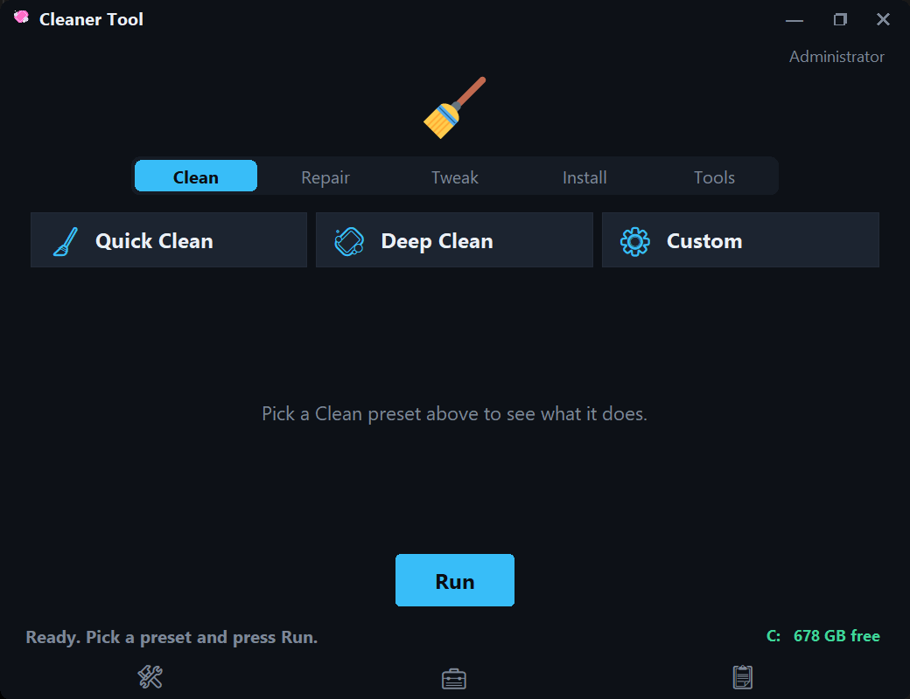
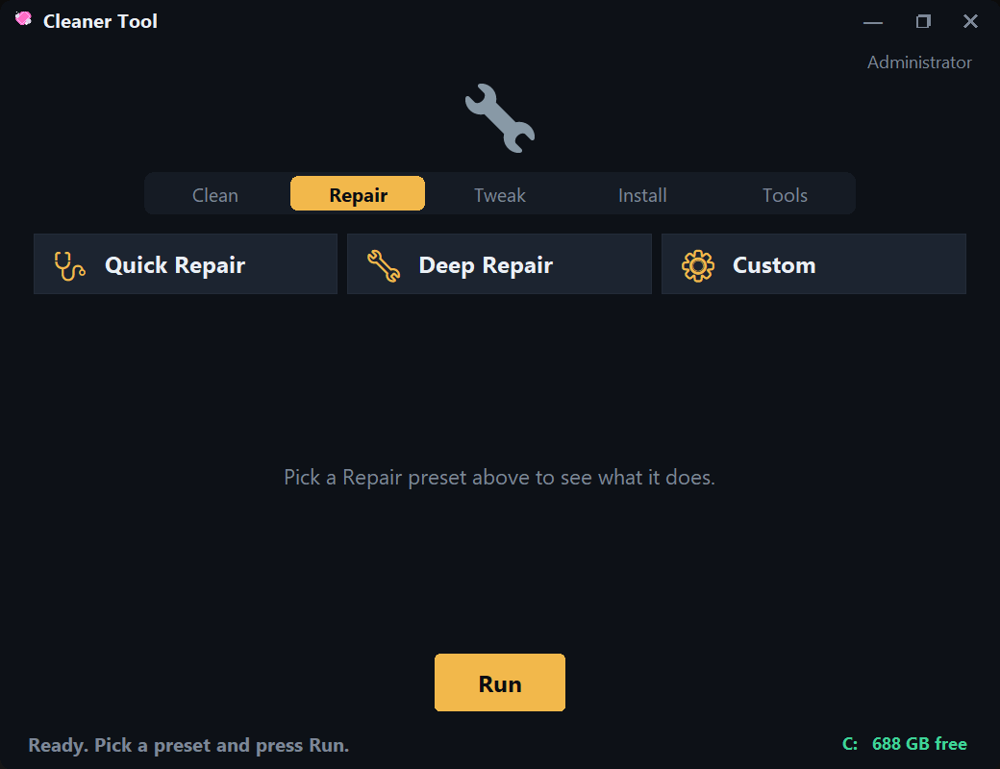
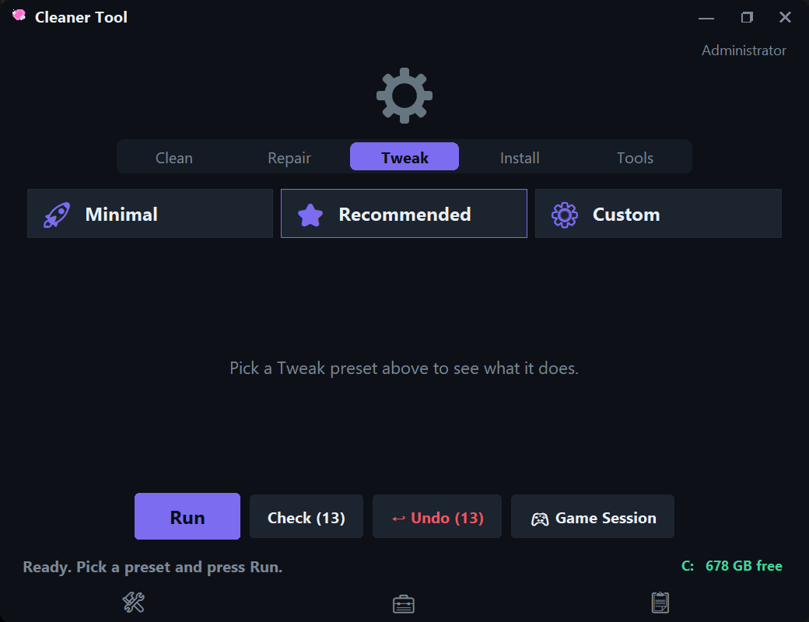
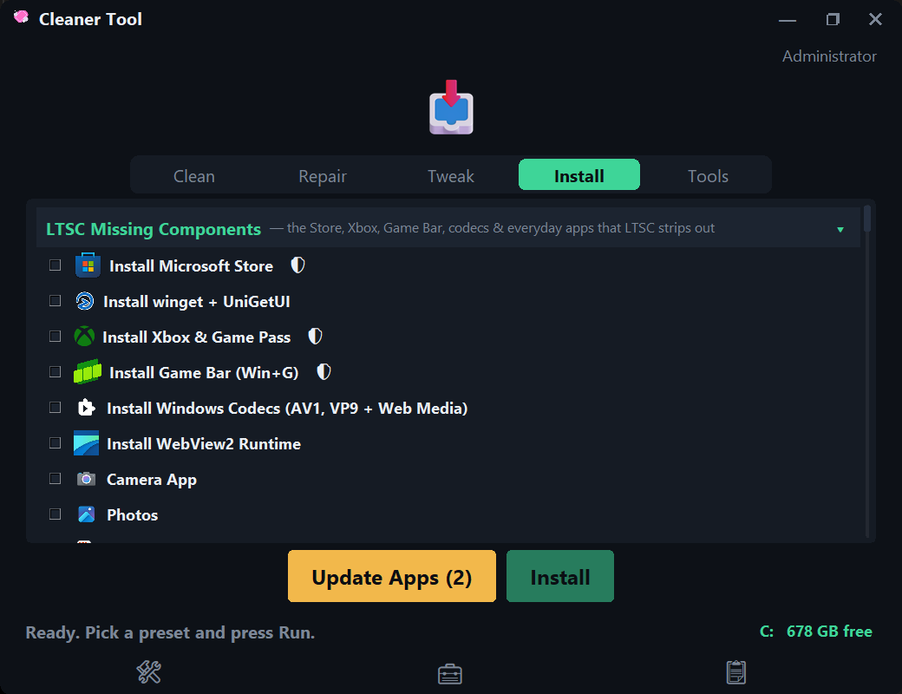

# 🧹 Cleaner Tool

**The safe, all-in-one Windows cleaner and optimizer built for gamers.**

Free up gigabytes of launcher cache, repair common Windows glitches, and apply safe, reversible gaming tweaks with a single click.

[📥 **Download Latest Release (CleanerTool.exe)**](https://github.com/MyLittlePrimordia/Cleaner-Tool/releases/latest)  
*Zero install. Just download and run.*

---

## 🛡️ Safe by Design

- **Your saves are protected:** Never touches game saves, personal documents, or user profiles.
- **1-Click Undo:** Every tweak includes a complete snapshot and restore button, plus an automatic Windows restore point.
- **No unnecessary admin rights:** Runs without elevation and only asks for admin when a specific repair task requires it.

---

## 📸 Screenshots

<table>
  <tr>
    <td align="center" width="50%">
      <b>Clean Tab</b><br/><br/>
      
    </td>
    <td align="center" width="50%">
      <b>Repair Tab</b><br/><br/>
      
    </td>
  </tr>
  <tr>
    <td align="center" width="50%">
      <b>Tweak Tab</b><br/><br/>
      
    </td>
    <td align="center" width="50%">
      <b>Install Tab</b><br/><br/>
      
    </td>
  </tr>
</table>

---

## ⚡ Key Features

- 🧹 **Game & Launcher Cleaner:** Clear shader caches, logs, and temp files from Steam, Epic, EA, Battle.net, Riot, Discord, and 25+ top games. Optionally remove preinstalled Windows bloatware.
- 🩺 **1-Click Repairs:** Fix corrupted system files (SFC/DISM), unstick frozen Windows Updates, repair Xbox/Game Pass services, and reset the network stack.
- 🚀 **Reversible Gaming Tweaks:** Enable Ultimate Performance power mode, lower network latency, disable telemetry/ad tracking, and restore classic right-click menus.
- 📦 **Essential Runtimes:** 1-click install all dependencies games need (DirectX, Visual C++ all-in-one, .NET, Java).
- 🧰 **Gamer Toolbox:** Built-in controller tester, live microphone test, internet speed test, and storage space visualizer.

---

## 🚀 Quick Start

1. Download [`CleanerTool.exe`](https://github.com/MyLittlePrimordia/Cleaner-Tool/releases/latest).
2. Choose a preset (e.g. **Quick Clean** or **Recommended Tweaks**).
3. Click **Run**. That's it!

---

## 📋 Requirements

- **Windows 10 or 11**
- Python 3.10+ *(only if running from source; the `.exe` requires nothing)*

---

<details>
<summary><b>🛠️ Background Mode & Auto Maintenance</b></summary>

All background features are strictly optional:
- **System Tray:** Minimize to the tray for low-disk space warnings and automatic maintenance.
- **Start with Windows:** Boots silently to the tray at login with standard user rights.
- **Auto-Maintenance Scheduler:** Run automated cleanups daily, weekly, or monthly.
- **Tweak Exception Note:** The optional advanced tweak *"No Explorer Auto Discovery"* clears per-folder view caches (`Bags/BagMRU`), which rebuild naturally as you browse rather than restoring previous view layouts. All other tweaks are 100% fully reversible.
</details>

<details>
<summary><b>💻 Running from Source & Building</b></summary>

### Run from Source
```powershell
python main.py
```

### Build Standalone `.exe`
```powershell
pip install -r requirements.txt
pyinstaller --onefile --windowed --name "CleanerTool" --icon "app/assets/icon.ico" --add-data "app/assets;assets" --manifest "app/assets/app_manifest.xml" app/__main__.py
```

### Run Tests
```powershell